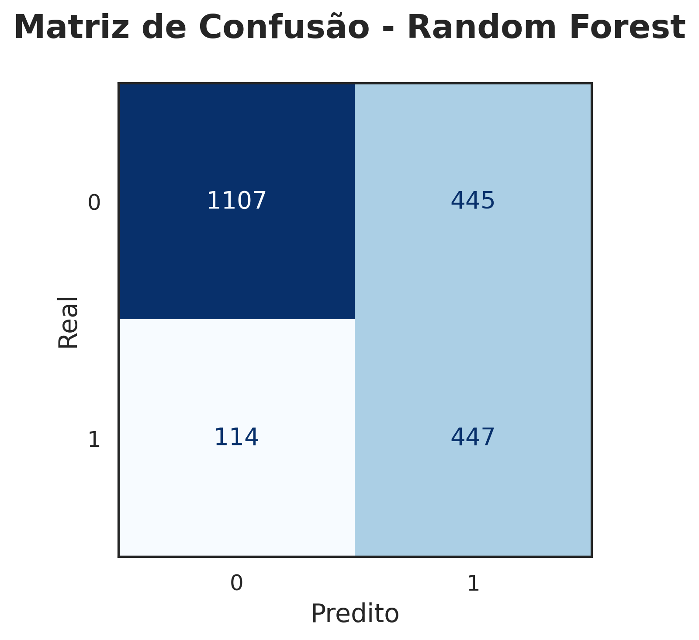

# Desafio Telecom X – Análise de Evasão de Clientes

Este projeto é a segunda parte do desafio da Alura, onde fui convidado a construir um modelo de classificação binária para prever a evasão de clientes (churn) da empresa fictícia Telecom X.

---

## O que tem aqui

- Preparação dos dados para o modelo (feature engineering, encoding, etc.)
- Seleção de variáveis relevantes para o modelo
- Seleção de modelos
- Interpretação dos resultados

## Resultados

### Distribuição de churn (cancelamento vs permanência)

**Explicação:** Este gráfico mostra a proporção de clientes que permaneceram versus os que cancelaram o serviço. É evidente o desbalanceamento, com a maioria dos clientes optando por continuar, o que é um ponto importante a considerar na modelagem preditiva.

---

### Churn por Tempo de Contrato e Total Gasto

**Explicação:** Aqui, analisamos a distribuição do tempo de contrato e o total gasto em relação ao churn.

---

### Correlação entre variáveis (Pearson)

**Explicação:** A matriz de correlação de Pearson revela relações lineares entre variáveis numéricas, ajudando a identificar quais fatores podem influenciar o churn e quais variáveis estão inter-relacionadas. Correlações fortes (positivas ou negativas) indicam áreas para investigação mais aprofundada.

---

### Informação Mútua (Mutual Information) das variáveis

**Explicação:** Este gráfico apresenta as variáveis mais relevantes para a previsão de churn, segundo a métrica de informação mútua. Permite direcionar avaliar quais variáveis são mais informativas para o modelo, auxiliando na seleção de features e no entendimento do impacto de cada variável na previsão.

---

### Matriz de confusão dos modelos

**Explicação:** As matrizes de confusão mostram o desempenho dos modelos de classificação, indicando acertos e erros na previsão de churn. São essenciais para avaliar a qualidade dos modelos e comparar abordagens.

### Curvas de precisão e recall

**Explicação:** Estas curvas avaliam a performance dos modelos em diferentes limiares de decisão, mostrando o equilíbrio entre precisão e recall. São fundamentais para escolher o modelo mais adequado ao problema de negócio.

---

### Partial Dependence Plots

#### Regressão Logística

#### Random Forest

**Customer Tenure**
O gráfico de Partial Dependence para a variável `customer_tenure` mostra uma relação negativa clara entre o tempo de permanência do cliente e a probabilidade de churn. 

- À medida que o `customer_tenure` aumenta, a dependência parcial diminui, indicando que clientes com maior tempo de permanência tendem a ter menor probabilidade do evento (como churn).
- Isso sugere que clientes mais antigos são menos propensos a deixar a empresa, um padrão esperado e consistente com o conhecimento de negócio.

**Account Contract**
O gráfico para a variável categórica `account_Contract` revela diferenças significativas entre os tipos de contrato:

- Contratos do tipo `Month-to-month` apresentam a maior dependência parcial, indicando maior probabilidade do evento previsto (exemplo: churn).
- Contratos com prazo de `One year` apresentam uma probabilidade intermediária.
- Contratos `Two year` têm a menor dependência parcial, indicando menor probabilidade do evento.

Essa distribuição faz sentido, pois contratos de curto prazo (mês a mês) geralmente indicam menor fidelidade e maior risco de cancelamento, enquanto contratos mais longos tendem a reter clientes por mais tempo.

---

## Conclusões

A análise exploratória revelou padrões importantes no comportamento dos clientes da Telecom X:

- **Tempo de relacionamento (tenure)** é o principal indicador de churn: clientes com pouco tempo de casa cancelam com muito mais frequência.  
- **Tipo de contrato** tem forte impacto: planos mensais concentram a maioria dos cancelamentos, enquanto contratos anuais ou bienais retêm melhor os clientes.  
- **Serviços adicionais**, como **Online Security** e **Tech Support**, estão associados a menor churn — indicando que oferecer suporte e segurança pode melhorar a retenção.  
- **Cobranças mensais mais altas** tendem a estar associadas a maiores taxas de churn, embora a correlação não seja tão forte.  
- **Variáveis demográficas básicas** (como gênero e dependentes) não mostraram relação significativa com o cancelamento.  

Esses insights ajudam a entender melhor os fatores que influenciam a evasão de clientes e fornecem uma base sólida para o desenvolvimento de modelos preditivos e ações estratégicas de retenção.

---

## Próximos passos

- Experimentar outros modelos de machine learning, como Gradient Boosting e XGBoost, para potencialmente melhorar a performance preditiva.
- Realizar tuning de hiperparâmetros para otimizar os modelos existentes.
- Feature engineering adicional, como criação de novas variáveis derivadas.
